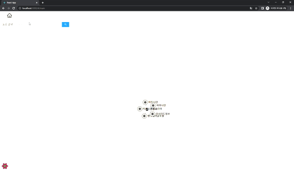

# Preview
- React.js + React Query + d3.js + redux-toolkit 활용 예제소스
- 그래프 데이터를 d3.js를 활용하여 시각화
- Flask 서버에 클러스터링 요청을 통한 노드 간 같은 클러스터링 목록 제공
- 검색을 통한 위치 포커싱

# Environment
- node
  - v16.18.0

# 프로젝트 소스 구조
```
components/
 - 랜더링에 공통으로 사용되는 위젯 또는 레이아웃
helper/
 - GraphQL client query, mutation 생성과 서버 API 요청파일
hooks/
 - 공통으로 사용되거나 페이지별로 사용되는 React 커스텀 훅과 쿼리
pages/
 - 라우터에 정의된 화면을 구성하는 컴포넌트
router/
 - SPA 구조에서 URL별 컴포넌트를 연결시키기 위한 해쉬라우터 사용
stores/
 - redux-toolkit 구조에 맞춰 action, reducer, global state 관리
styles/
 - 화면 또는 컴포넌트에 필요한 스타일
types/
 - 타입스크립트 작성시 필요한 인터페이스 및 타입
```

# 주요 프로젝트 소스
```
Graph.tsx
 - 그래프 데이터 시각화를 위하여 d3.js를 활용한 노드 엣지 위젯 컴포넌트
 - react local state와 sid effect를 활용하여 svg 및 
   d3.js 노드, 엣지 enter, update, exit
 - force simulation, tick을 활용하여 능동적인 그래프 인터렉션 제공
hooks/*
 - react 커스텀 훅을 활용하여 global state 또는 react query 데이터 활용
 - react query는 브라우저에서 공통으로 사용할 정보들을 활용하기 위한 방법으로 사용
stores/*
 - redux toolkit 사용방법 예제 action -> dispatcher -> store -> view
   관련 기본적인 사용방법
```

# 간단한 예제 화면
 - 